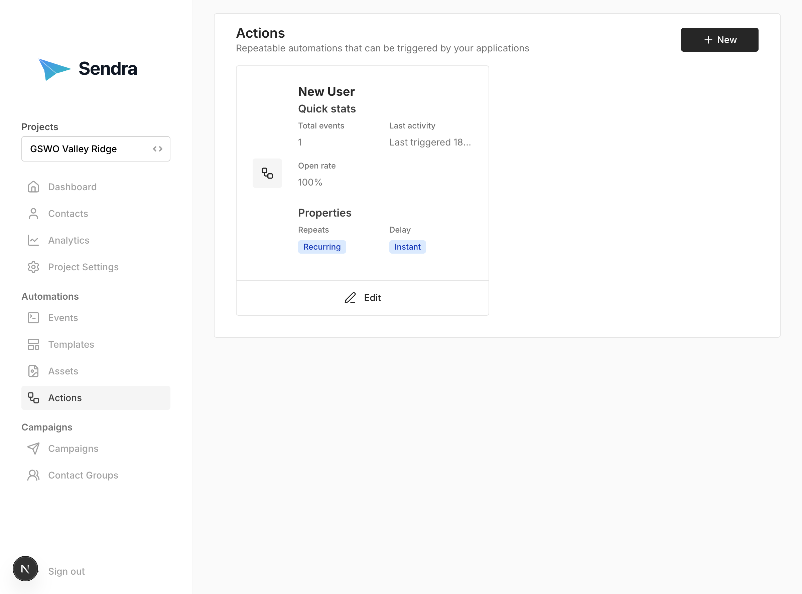
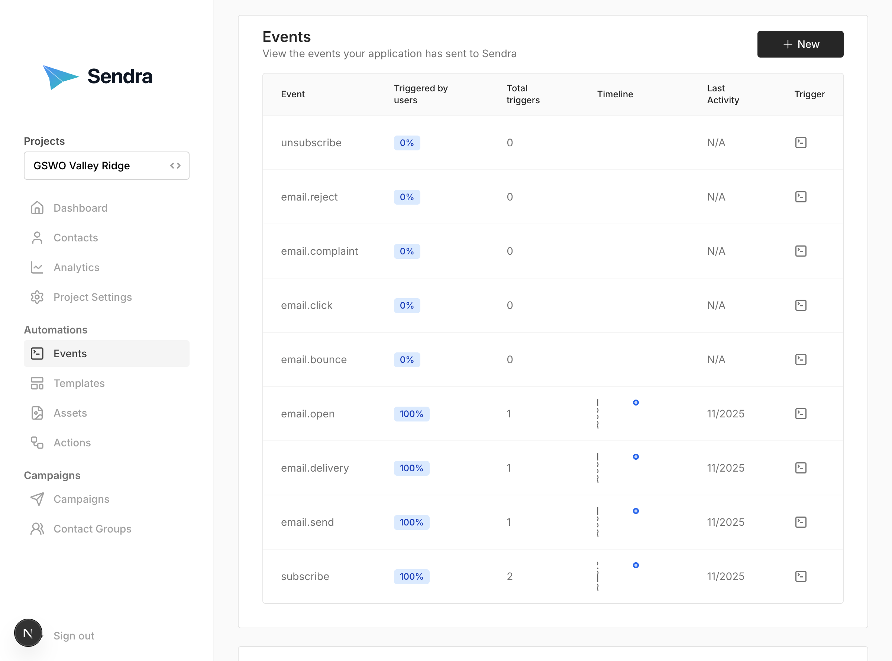

## Actions 

Actions are automated email workflows triggered by events.



### Understanding Actions

Actions create "if-then" rules:
- **IF** a user triggers certain events
- **AND** hasn't triggered exclusion events
- **THEN** send a specific template
- **AFTER** an optional delay
- **ONCE** (optional) per contact

### Creating an Action

1. Go to **Actions** → **"New Action"**
2. Configure the action:
   - **Name**: Descriptive name (e.g., "Welcome Email")
   - **Template**: Select template to send
   - **Trigger Events**: Events that activate this action
   - **Exclusion Events**: Events that prevent this action
   - **Run Once**: Check to send only once per contact
   - **Delay**: Time to wait before sending (in seconds)
3. Click **"Create Action"**

### Example: Welcome Email

```
Name: Welcome Email
Template: Welcome Template
Trigger Events: ["signup-completed"]
Exclusion Events: []
Run Once: true
Delay: 0 seconds
```

**Result:** When a user signs up, they immediately receive the welcome email once.

### Example: Abandoned Cart

```
Name: Abandoned Cart Reminder
Template: Cart Reminder Template
Trigger Events: ["cart-created"]
Exclusion Events: ["purchase-completed"]
Delay: 3600 seconds (1 hour)
Run Once: false
```

**Result:** If a user creates a cart but doesn't complete purchase within 1 hour, they receive a reminder.

### Example: Onboarding Series

```
Action 1:
- Name: Onboarding Email 1
- Trigger: ["signup-completed"]
- Delay: 0 seconds

Action 2:
- Name: Onboarding Email 2
- Trigger: ["signup-completed"]
- Delay: 86400 seconds (1 day)

Action 3:
- Name: Onboarding Email 3
- Trigger: ["signup-completed"]
- Delay: 259200 seconds (3 days)
```

**Result:** Users receive a drip campaign over several days after signup.

### Action Logic

**Multiple Trigger Events (OR logic):**
```
Trigger Events: ["signup-completed", "trial-started"]
```
Action triggers if user does ANY of these events.

**Exclusion Events (NOT logic):**
```
Exclusion Events: ["account-cancelled", "unsubscribed"]
```
Action won't trigger if user has done ANY exclusion event.

### Editing Actions

1. Go to **Actions**
2. Click on action to edit
3. Update configuration
4. Click **"Save Changes"**

{: .note }
Changes apply to future triggers only. Already-scheduled emails are not affected.

### Monitoring Actions

View action activity:
1. Go to **Actions**
2. Click on an action
3. See recent triggers and emails sent

## Events

Events track user actions and behaviors.



### Understanding Events

Events represent things users do:
- Sign up for account
- Complete purchase
- Start free trial
- Download resource
- Click link
- Abandon cart
- Cancel subscription

### Viewing Events

Navigate to **Events** to see:
- All tracked events
- Event types
- Associated contacts
- Event data
- Timestamps

### Event Types

**Built-in Events:**
- Email sent
- Email delivered
- Email opened
- Email clicked

**Custom Events:**
- Defined by your application
- Track anything important to your business

### Tracking Events via API

Events are typically tracked from your application:

```javascript
// Example: Track a purchase
POST /projects/:projectId/track
{
  "email": "customer@example.com",
  "event": "registered",
  "data": {
    "source": "word of mouth",
    "region": "EMEA"
  }
}
```

The data provided will be used to update the contact in the following manner:

 - Any new key will be added to the contact
 - Any existing key where both the existing and updated value are arrays, only new values will be appended to the array
 - Any other value of an existing key will be overridden

See the [API Documentation](../api.html) for complete details.

### Transient Event Data

Each event can include transient data:

```json
{
  "event": "purchase-completed",
  "data": {
    "name": "Sally"
  },
  "transientData": {
    "orderId": "ORD-123",
    "amount": 99.99,
    "product": "Premium Plan"
  }
}
```

This data:
- Stored with the event
- Can be used in email templates
- Will not be saved to the contact

