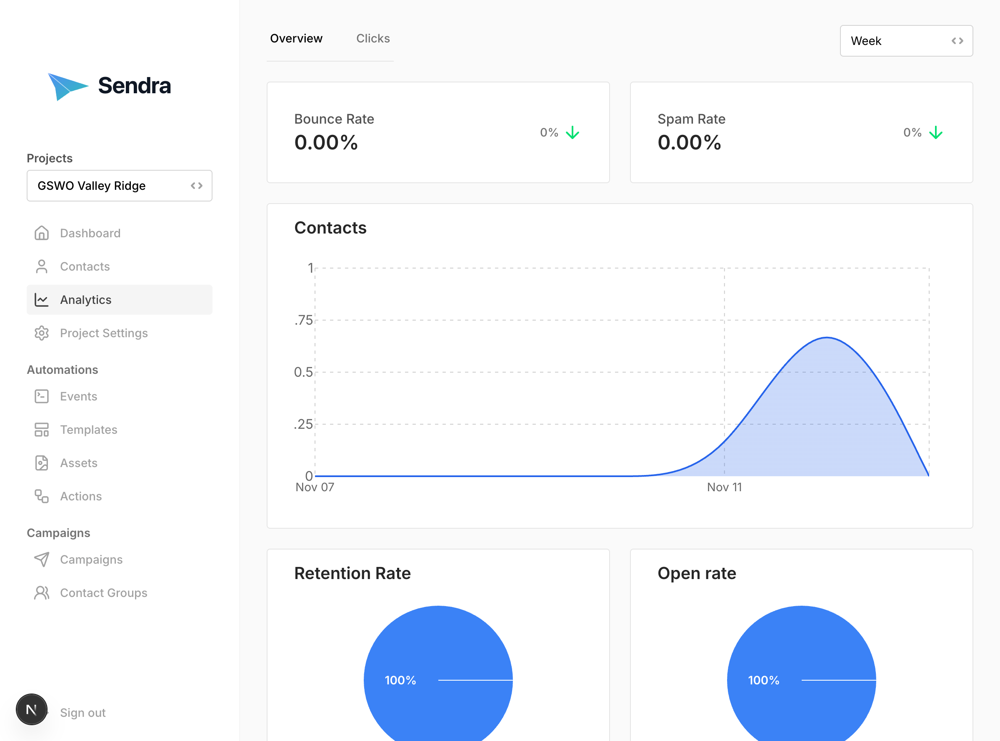

[Docs](../index.md) > [User Guide](../user-guide.md) > Analytics

## Analytics

Track email performance and engagement.

### Accessing Analytics

Navigate to **Analytics** from the main menu.

### Available Metrics

**Email Performance:**
- **Sent**: Total emails sent
- **Delivered**: Successfully delivered
- **Delivery Rate**: Percentage delivered
- **Open Rate**: Percentage opened
- **Clicked**: Link clicks

### Time Periods

View analytics for:
- **Last 7 days**
- **Last 30 days**
- **Last 90 days**

### Analytics by Campaign

1. Go to **Campaigns**
2. Click on a campaign
3. View campaign-specific metrics

### Analytics by Template

1. Go to **Templates**
2. Click on a template
3. See aggregated performance across all uses

### Click Analytics

View detailed click tracking:
1. Go to **Analytics** → **Clicks**
2. See all link clicks
3. View:
   - Which links were clicked
   - When they clicked