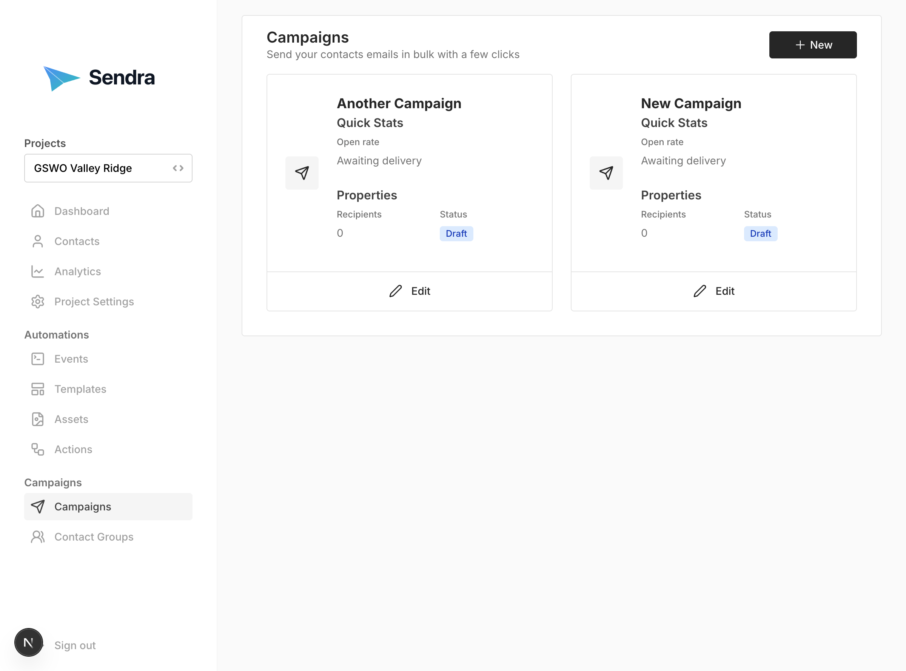

## Campaigns

Campaigns are one-time broadcasts to your audience.

### Creating a Campaign

1. Go to **Campaigns** → **"New"**
2. Set the Subject and Template
2. Fill in campaign details:
   - **Body**: Email content (HTML supported)
   - **From Name**: Sender name (optional)
   - **From Email**: Sender email (optional)
3. Select recipients:
   - **Specific Contacts**: Choose individual contacts
   - **Groups**: Select entire groups
   - **All Contacts**: Target all subscribed contacts
4. Click **"Create Campaign"**

### Campaign Status

**DRAFT:**
- Campaign is saved but not sent
- Can be edited
- No emails have been sent

**DELIVERED:**
- Campaign has been sent
- Cannot be edited
- Emails have been queued/delivered

### Sending a Campaign

1. Open your draft campaign
2. Review all details carefully
3. Click **"Save & Send"**
5. Confirm and send

**Important:** Once sent, campaigns cannot be recalled or edited.

### Targeting Options

**Option 1: Specific Contacts**
- Manually select individual contacts
- Best for small, targeted sends
- Maximum control

**Option 2: Groups**
- Select one or more groups
- All contacts in selected groups receive email
- Easy audience management

**Option 3: All Subscribed Contacts**
- Use special "all" recipient
- Sends to every subscribed contact
- Best for newsletters

{: .note }
Only subscribed contacts receive emails, regardless of targeting method.

### Campaign Analytics

After sending a campaign:

1. Open the campaign
2. View metrics:
   - **Sent**: Total emails sent
   - **Delivered**: Successfully delivered
   - **Opened**: Unique opens

### Best Practices for Campaigns

1. **Test before sending**
   - Send to the project members first
   - Check all variables
   - Test on mobile devices

2. **Write compelling subject lines**
   - Keep under 50 characters
   - Be clear and specific
   - Avoid spam trigger words

3. **Segment your audience**
   - Use groups for targeting
   - Don't spam your entire list
   - Personalize content

4. **Include unsubscribe link**
   - Required for compliance
   - Builds trust
   - Improves deliverability

5. **Monitor results**
   - Check analytics after sending
   - Learn from performance
   - Iterate and improve
