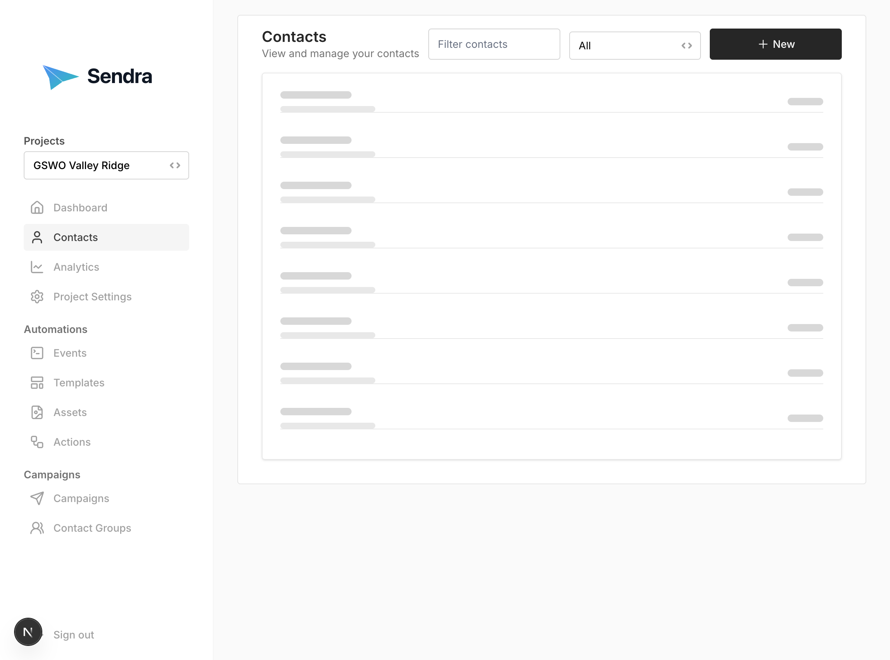
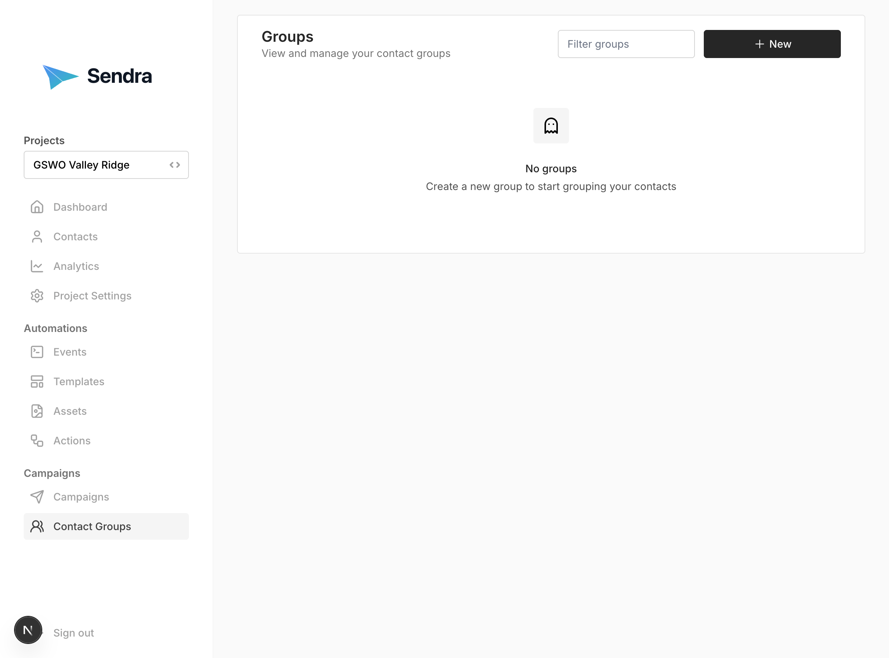

## Contacts

Contacts are your email recipients.

### Viewing Contacts

Navigate to **Contacts** to see:
- List of all contacts
- Email addresses
- Subscription status
- Creation dates

### Adding a Contact

1. Go to **Contacts** → **"New Contact"**
2. Enter email address
3. Set subscription status
4. Add contact data:
   - **If a contact schema is defined**: The form will automatically generate fields based on your project's JSON schema
   - **If no schema is defined**: Use the free-form metadata editor to add custom key-value pairs (name, company, preferences, etc.)
5. Click **"Create Contact"**

**Note:** If your project has a contact data schema defined (see [Project Settings - Contact Schema](../project-settings#contact-data-schema)), the contact form will automatically generate structured fields based on the schema. This ensures consistent data structure and provides validation.

## Groups

Groups organize contacts to make it easier to send campaigns to multiple contacts at once

### Creating a Group

1. Go to **Contact Groups** → **"New Group"**
2. Enter group name (e.g., "Premium Users")
3. Select contacts to add
4. Click **"Create Group"**

**Note:** Contacts can belong to multiple groups.

### Deleting Groups

1. Go to **Contact Groups**
2. Click on group
3. Click **"Delete"**
4. Confirm deletion

**Note:** Deleting a group does not delete contacts.