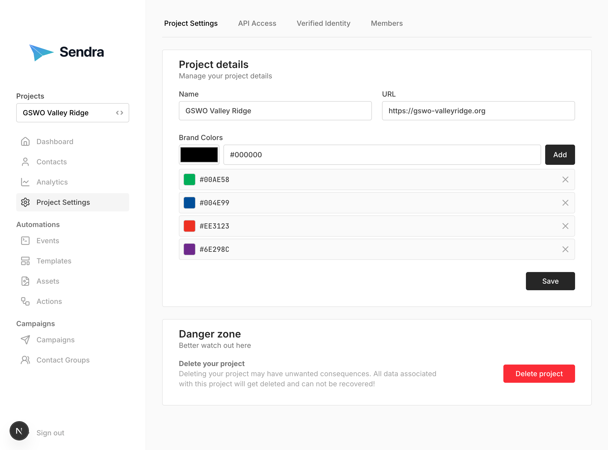

## Project Settings



### Switching Projects

If you're a member of multiple projects:

1. Click the project dropdown (top left)
2. Select the project you want to work with
3. Dashboard updates to show selected project data

### Creating Additional Projects

1. Click project dropdown → **"New Project"**
2. Enter project name and URL
3. Click **"Create"**
4. Save your new API keys

### Project Settings

Access via **Project Settings**

**Configurable Options:**
- Project name
- Website URL

**To Update Project:**
1. Modify the fields you want to change
2. Click **"Save Changes"**

### Contact Data Schema

Access via **Project Settings** → **Contact Schema**

Define a JSON schema to structure and validate contact data. When a schema is defined, contact forms will automatically generate fields based on the schema, providing a consistent data structure across the project.

**To Define a Contact Schema:**

1. Navigate to **Project Settings** → **Contact Schema**
2. Enter a JSON schema in the text area
3. Click **"Save Schema"**

**Example Schema:**
```json
{
  "type": "object",
  "properties": {
    "firstName": {
      "type": "string",
      "title": "First Name",
      "minLength": 1
    },
    "lastName": {
      "type": "string",
      "title": "Last Name"
    },
    "company": {
      "type": "string",
      "title": "Company"
    },
    "plan": {
      "type": "string",
      "enum": ["free", "premium", "enterprise"],
      "title": "Plan"
    }
  },
  "required": ["firstName", "lastName"]
}
```

**Benefits:**
- Automatic form generation based on schema
- Data validation when creating or updating contacts
- Consistent data structure across your project

**Note:** Projects without a schema will continue to use the free-form metadata editor. See [JSON Schema documentation](https://json-schema.org/learn/getting-started-step-by-step) for more information on schema syntax.

### API Access

Access via **Project Settings** → **API Access**

**View Your API Information:**
- **API Endpoint**: the base URL for the API
- **Project ID**: the ID of the current project
- **Public Key**: Safe for client-side use (limited access)
- **Secret Key**: Full access (keep secure!)

### Verified Identity

To use Sendra, each project must have a verified identity. Verified identities can either be an Email Address or a Domain. Depending on your Sendra configuration, projects may be able to share identities or require unique identities.

When configuring an identity for the first time, you will need to specify a number of DNS records to verify access. Once the records are verified, the domain will appear as verified and you can start sending emails.


### Member Management

Access via **Project Settings** → **Members**

- See all project members
- View their roles

**Invite Members:**
1. Click **"Invite Member"**
2. Enter email address
3. Select role (ADMIN or MEMBER)
4. Click **"Send Invite"**
5. They receive invitation email

**Remove Members:**
1. Click on member
2. Click **"Kick"**
3. Confirm removal

**Roles:**
- **ADMIN**: Full project access, can manage team
- **MEMBER**: Can use project features, cannot manage team

### Deleting a Project

Access via **Project Settings** → **Danger Zone**

**Warning:** This action:
- Permanently deletes all project data
- Cannot be undone
- Removes all contacts, campaigns, templates, and events
- Requires admin role